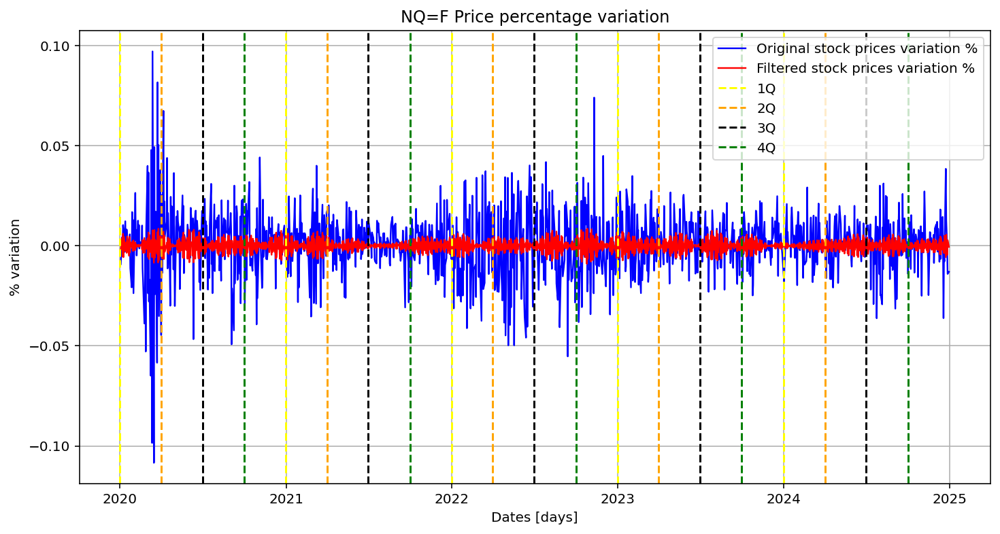

# Fourier-Transform-in-Finance
## Application of the **Fast Fourier Transform** (FFT) for detecting patterns in *financial time series*. 

There is a huge literature concerning the application of the FFT in finance, more specifically applied in financial time series in order to detect patterns or general characteristics.\
The aim of this project is just to give a very straightforward implementation of the algorithm to model some time series.

The main libraries used are:
* **yfinance:** for collecting financial data;
* **scipy:** for computing the FFT.

## Example
The image below shows the output of the script applied on the *Nasdaq* index.\
Keep in mind that you can change the order of the quarters based on the index of interest by tweaking the code in the lines `122-125`.\
In general, pay attention to all the `N.B.:` present on the script, because they contain useful information for the hyperparameters present.

## Analysis and further possible expansions
As shown by the image above, there seem to be four strong variations of the signal gathered by four blobs for all fiscal years, and nearly all of them seem to appear between the two boundaries set by two adjancent quarters.\
It could be interesting trying to apply it in many other time series to see if they show the same characteristics.\
This could be just the starting point of many possible interesting projects and further developments.\

### Notice
The **y-axis** shows the price percentage variations, instead of the pure price.\
This is done in order to make the signal stationary, because the FFT assumes the input signal with no change over time of its statistical properties (mean, variance, ...).
